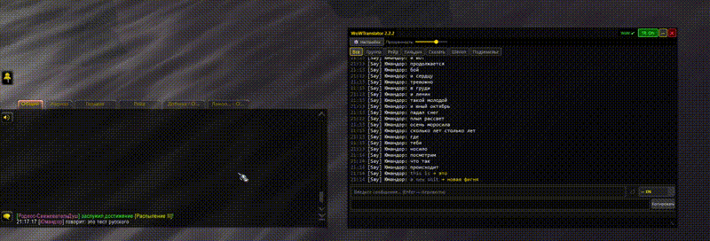

<p align="center">
  
</p>

<h1 align="center">BabelChat</h1>

<p align="center">
  <b>Rompe la barrera del idioma en World of Warcraft</b><br>
  Traducción de chat en tiempo real — app acompañante + addon de WoW
</p>

<p align="center">
  <a href="README.md">English version</a> |
  <a href="README_ru.md">Русская версия</a>
</p>

<p align="center">
  <a href="LICENSE"></a>
  <a href="https://python.org"></a>
  <a href="https://github.com/Yumash/BabelChat/releases"></a>
</p>

<p align="center">
  <a href="https://buymeacoffee.com/franciscorb"></a>
  &nbsp;
  <a href="https://yumatech.ru/donate/"></a>
</p>

---

<p align="center">
  
  <br>
  <a href="assets/demo.mp4">Ver demo completo (43s)</a>
</p>

## El Problema

Entras a una banda PUG. El tanque explica tácticas — en ruso. El sanador pregunta algo — en alemán. Tú hablas español. Nadie se entiende. Comienza el pull, la gente muere, y alguien escribe "gg noob" — la única frase que todos conocen.

**Esto pasa constantemente** en los grupos cross-realm y cross-región de WoW. La barrera del idioma arruina la coordinación, causa wipes y hace el juego menos divertido.

## La Solución

BabelChat traduce el chat de WoW **en tiempo real**. Un pequeño addon captura los mensajes del juego; una app acompañante los traduce via DeepL y muestra los resultados en un elegante overlay sobre WoW.

**Ves el mensaje original al instante. La traducción aparece 0.5–2 segundos después.**

Frases comunes como "gg", "ty", "ready?", "pull" se traducen al instante desde un frasario integrado — sin llamada API, sin demora. Las oraciones completas pasan por DeepL y llegan en 1–2 segundos. El mismo mensaje nunca se traduce dos veces (caché).

### ¿Cuándo es útil BabelChat?

- **PUGs cross-realm** — entiende las tácticas del tanque ruso, las preguntas del sanador alemán
- **Hermandades internacionales** — sigue el chat de hermandad en tu idioma sin pedir "english pls"
- **Jugando en servidores extranjeros** — ¿entraste a un realm francés o coreano? El chat ahora es legible
- **Liderando bandas** — da comandos en tu idioma, los jugadores los ven en el suyo
- **Susurros de desconocidos** — entiende ese mensaje aleatorio en portugués

## Características

- **Traducción streaming** — el original aparece al instante, la traducción sigue 0.5–2s después
- **Detección automática de idioma** — offline, ~1ms por mensaje (lingua-py)
- **22 idiomas** — EN, RU, DE, FR, ES, IT, PT, PL, NL, SV, DA, FI, CS, RO, HU, BG, EL, TR, UK, JA, KO, ZH
- **Overlay inteligente** — tema oscuro WoW, colores de canal, transparente al clic
- **Traducción bidireccional** — traduce chat entrante Y compone mensajes salientes
- **Frasario integrado** — 45 frases + 30 abreviaturas gaming sin API
- **Glosario WoW** — 314 términos gaming (lfm, wts, dps, tank, etc.) en 14 idiomas
- **Filtros de canal** — Grupo, Banda, Hermandad, Decir/Gritar, Susurro, Mazmorra
- **API DeepL gratuita** — 500.000 caracteres/mes gratis (~10K mensajes)
- **Caché de traducciones** — SQLite thread-safe + LRU
- **Teclas de acceso rápido** — activa/desactiva sin salir del juego
- **Instalación del addon en un clic**

## ¿Por qué la traducción tarda 0.5–2 segundos?

BabelChat usa **renderizado progresivo** (streaming):

1. **Ves el mensaje original inmediatamente** (0ms de demora)
2. **La traducción aparece debajo** cuando DeepL responde (0.5–2s)

La demora viene del round-trip a los servidores de DeepL — tu texto viaja, se traduce por una red neuronal y vuelve. Es la misma latencia que Google Translate o cualquier servicio de traducción en la nube.

**Instantáneo (sin demora):**
- Abreviaturas gaming: `gg`, `ty`, `brb`, `afk`, `wp`, `lol` — del frasario
- Frases comunes: "hello", "thanks", "ready?" — del frasario
- Mensajes repetidos — del caché
- Mensajes en tu propio idioma — se muestran sin traducción

**0.5–2s:**
- Oraciones completas en idiomas extranjeros — requieren llamada API a DeepL
- Primera aparición de cualquier frase — luego se cachea

## Cómo funciona

```
┌──────────────────────────────────────────────────────────┐
│  World of Warcraft                                       │
│                                                          │
│  Addon BabelChat                                         │
│  ├── Intercepta eventos CHAT_MSG_* via WoW API           │
│  ├── Buffer circular (50 mensajes)                       │
│  └── Escribe en BabelChatDB.wctbuf (Lua SavedVariable)  │
└──────────┬───────────────────────────────────────────────┘
           │  ReadProcessMemory (cada 250ms)
           ▼
┌──────────────────────────────────────────────────────────┐
│  App acompañante (Python, como admin)                    │
│                                                          │
│  Memory Reader ──→ Parser ──→ Detector de idioma         │
│       │                           │                      │
│       │    Frasario (instantáneo) ┤                      │
│       │    Caché (instantáneo) ───┤                      │
│       │    DeepL API (0.5-2s) ────┤                      │
│       │                           ▼                      │
│       └───────────────→ Overlay (PyQt6)                  │
└──────────────────────────────────────────────────────────┘
```

### ¿Por qué una app acompañante?

El sandbox Lua de WoW **no puede hacer peticiones HTTP**. El addon captura el chat pero no puede llamar a DeepL. La app acompañante resuelve esto leyendo el buffer del addon desde la memoria del proceso.

Es el mismo enfoque de **WeakAuras Companion** y **WarcraftLogs** — acceso de solo lectura, cumple con los Términos de Servicio de Blizzard.

## Instalación

### Inicio rápido

1. Descarga `BabelChat.zip` de [Releases](https://github.com/Yumash/BabelChat/releases)
2. Extrae y ejecuta `BabelChat.exe` **como Administrador**
3. Sigue el asistente (obtén una [clave API gratuita de DeepL](https://www.deepl.com/pro-api), configura la ruta de WoW, instala el addon)
4. Abre WoW, entra a un grupo — las traducciones aparecerán automáticamente

### Desde el código fuente

```bash
git clone https://github.com/Yumash/BabelChat.git
cd BabelChat
pip install -r requirements.txt
python -m app.main  # ejecutar como Administrador
```

### Addon WoW (manual)

Copia `addon/BabelChat/` a `World of Warcraft/_retail_/Interface/AddOns/BabelChat/`

## Glosario WoW

BabelChat incluye un diccionario de **314 términos gaming** en **14 idiomas**:

| Categoría | Ejemplos | Cantidad |
|-----------|----------|----------|
| Social | ty, thx, np, gj, lol, gg, brb, omw | 71 |
| Clases y specs | warrior, dk, ret, bm, disc, resto | 59 |
| Banda y mazmorra | trash, wipe, nerf, ninja, boe, cd | 54 |
| Combate | aggro, aoe, cc, dps, heal, tank, dot | 33 |
| Grupos | lfm, lf1m, lf2m, premade | 29 |
| Estadísticas | hp, mana, crit, haste, mastery | 19 |
| Profesiones | jc, bs, enchant, herb, alch, tailor | 17 |
| Estado | afk, oom, brb, omw | 11 |
| Comercio | wtb, wts, wtt, cod, mats, bis | 8 |
| Roles | tank, healer, dps | 7 |
| Hermandad | gm, officer, recruit, gbank | 5 |

### Contribuir términos

Edita el archivo `addon/BabelChat/Data/*.lua` correspondiente:

```lua
["newterm"] = {
    enUS = "English translation",
    esES = "Traducción española",
    ruRU = "Русский перевод",
    -- ... (14 idiomas)
},
```

## Cumplimiento con ToS de Blizzard

| Aspecto | Estado |
|---------|--------|
| Lectura de memoria | Solo lectura. Como WeakAuras Companion, WarcraftLogs |
| Overlay | Permitido. Como Discord Overlay |
| API del addon | Hooks estándar CHAT_MSG_*. Usado por todos los addons de chat |
| Sin inyección | Sin DLL injection, sin hooking, sin escritura en memoria de WoW |
| Sin automatización | Traducción saliente via portapapeles (pegado manual Ctrl+V) |

## Limitaciones

- **Solo Windows** — ReadProcessMemory es una API de Windows
- **Requiere Administrador** — la lectura de memoria necesita privilegios elevados
- **Límite DeepL Free** — 500K caracteres/mes (~10K mensajes). Hay planes de pago
- **Mensajes salientes** — copiar → pegar en chat WoW (por diseño, cumplimiento ToS)

## Apoyar el proyecto

Proyecto creado por dos autores:

| Componente | Autor | Apoyar |
|------------|-------|--------|
| **Glosario WoW** — 314 términos en 14 idiomas, idea de traducción en el juego | **Pirson** | [Buy Me a Coffee](https://buymeacoffee.com/franciscorb) |
| **App acompañante** — overlay, traducción DeepL, lectura de memoria, streaming | **Andrey Yumashev** | [Donate](https://yumatech.ru/donate/) |

## Documentación

- **[User Guide](docs/user/README.md)** — quick start, configuration, FAQ (EN)
- **[Technical Docs](docs/tech/README.md)** — architecture, memory reader, pipeline (EN)

## Reconocimientos

- **[WoW Translator](https://www.curseforge.com/wow/addons/wow-translator)** de **Pirson** (licencia MIT) — glosario de términos WoW en 14 idiomas. El diccionario de BabelChat está basado en los datos de este addon.

## Autores

- **Andrey Yumashev** — [@Yumash](https://github.com/Yumash) — app acompañante, overlay, lectura de memoria
- **Pirson** — [CurseForge](https://www.curseforge.com/wow/addons/wow-translator) — diccionario WoW y motor de traducción
- **Claude** (Anthropic) — Co-autor IA

## Licencia

[MIT License](LICENSE)
